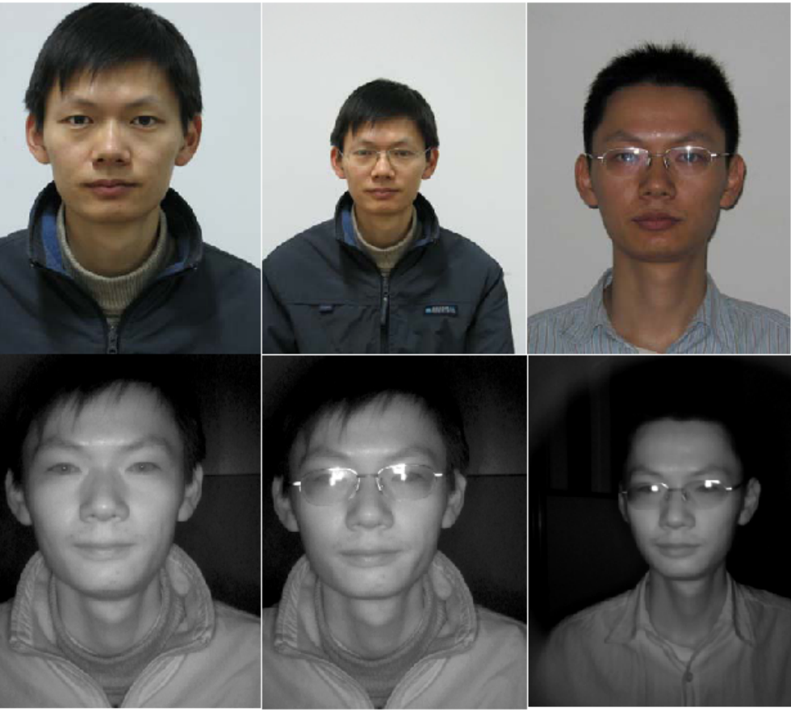

.. vim: set fileencoding=utf-8 :
.. @author: Tiago de Freitas Pereira <tiago.pereira@idiap.ch>
.. @date:   Fri 29 Apr 2016 09:09:16 CEST 

.. _bob.db.cbsr_nir_vis_2:

=======================================
CASIA NIR-VIS 2.0 Database
=======================================

This package contains the access API and descriptions for the `CASIA NIR-VIS 2.0 Database <http://www.cbsr.ia.ac.cn/english/NIR-VIS-2.0-Database.html>`. 
The actual raw data for the database should be downloaded from the original URL. 
This package only contains the Bob accessor methods to use the DB directly from python, with the original protocol of the database.

CASIA NIR-VIS 2.0 database offers pairs of mugshot images and their correspondent NIR photos. The images of this database were collected in four recording sessions: 2007 spring, 2009 summer, 2009 fall and 2010 summer, in which the first session is identical to the CASIA HFB database. It consists of 725 subjects in total. There are [1-22] VIS and [5-50] NIR face images per subject. The eyes positions are also distributed with the images.

If you use this package, please cite the authors of the database::

  @inproceedings{li2013casia,
  title={The casia nir-vis 2.0 face database},
  author={Li, Stan Z and Yi, Dong and Lei, Zhen and Liao, Shengcai},
  booktitle={Computer Vision and Pattern Recognition Workshops (CVPRW), 2013 IEEE Conference on},
  pages={348--353},
  year={2013},
  organization={IEEE}     
   }

Documentation
-------------

.. toctree::
   :maxdepth: 2

   guide
   py_api

Indices and tables
------------------

* :ref:`genindex`
* :ref:`modindex`
* :ref:`search`

